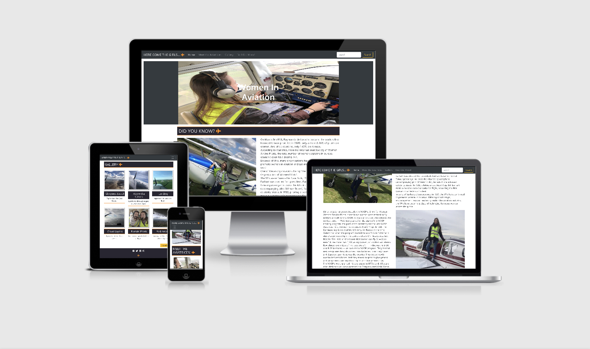
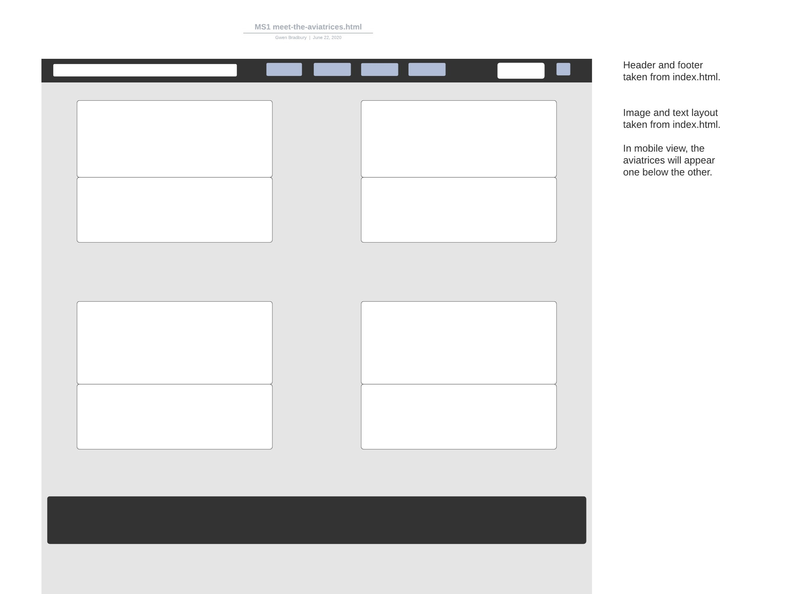
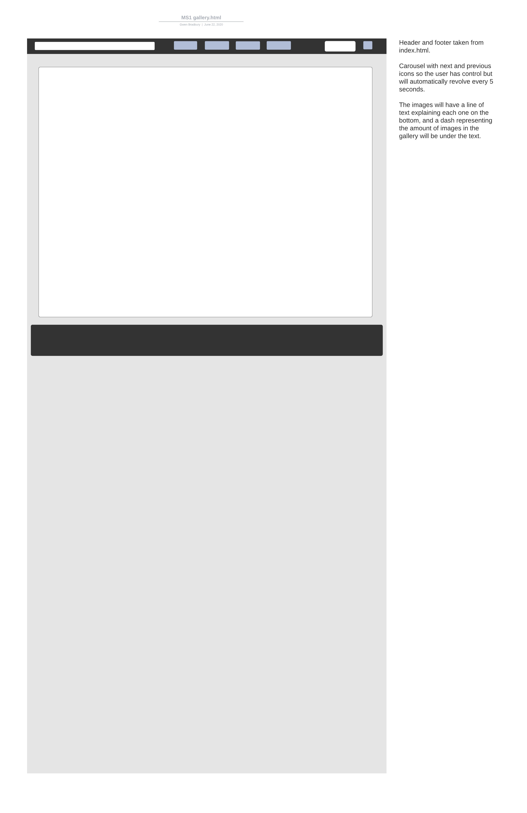

# Women In Aviation.

- [Women In Aviation.](#women-in-aviation)
- [UX.](#ux)
    + [Wireframes-](#wireframes-)
    + [Colour Palette-](#colour-palette-)
    + [User stories-](#user-stories-)
- [Features.](#features)
  * [Existing Features-](#existing-features-)
- [Technologies used.](#technologies-used)
- [Testing.](#testing)
- [Deployment.](#deployment)
- [Credits.](#credits)
  * [Content-](#content-)
  * [Media-](#media-)
  * [Acknowledgements-](#acknowledgements-)

<small><i><a href='http://ecotrust-canada.github.io/markdown-toc/'>Table of contents generated with markdown-toc</a></i></small>

## Women In Aviation.

This is my first milestone project; Designed to exhibit my capabilities and skills in html and css, as a student 
of Code Institute. (https://codeinstitute.net/)
The goal was to showcase my skills to potential employers/recruiters, on a topic that I'm deeply interested in.
My project is about inspiring more women to get into the world of aviation and become pilots.

## UX.

The purpose of the site is to provide a simple, easy to use format presenting information about the pioneers 
of women in aviation.
My website is designed for people curious about getting into aviation, specifically women, and im hopeful my website 
will give them the motivation towards getting into the cockpit.

#### Wireframes-

  
  
  

After speaking to my mentor it was advised that I remove the carousel, in gallery.html, and have a grid system for my images, to make them more user friendly.

#### Colour Palette-

https://coolors.co/292122-fe6d04-fdffff

#### User stories- 

   * As a potential female pilot, I want to quickly and easily find all relevant information on women in aviation. A brief history on women in avitation can be found in the index.html home page, and for 
     current female pilots, the Meet The Aviatrices page has a list of current pilots, including a picture and small discription on why they love flying. They can also add thier name and email into the Find Out More modal
     and someone will email them back to answer any specific questions they might have.

   * As an employer/recruiter, I need to see and review the skills and work capabilities, and analyze if you have the skills we require. In this website I've used many user-friendly features to showcase my skills as a developer.
     From the layout and colour scheme to the scroll bar on the Meet The Aviatrices quotes section, every implemented piece of code has been built to make the site as appealing and easy to use for customers as possible. 
     Possible employers will be able to see from the website and the features implemented that my standard of work is very high, and my capabilities reflect my current skillset, which will improve as I gain more knowledge moving through 
     the Code Institute Full Stack Developer course.

   * On our Human Resources team, we look for the information that pertains to the specific needs of the company, and does this individual have those skill sets. My skill sets are evidenced in the website produced. I've used a wide range of HTML and CSS to 
     develop this site, as well as technologies such as bootstrap for responsiveness.

## Features.

### Existing Features-

* __Home__ - A picture and introduction to what my website is about. This page also includes a brief history on women in aviation and a sneak peak into the information on the following pages, set out in different sections.

* __Meet the aviatrices__ - Pictures and quotes from female pilots discussing what they love about flying. The quotes have a scroll bar to make the page look more tidy and are in a card layout with the image sitting above the pilots name and quote.

* __Gallery__ - In flight images taken on various flights to hopefully give the viewer a closer look into the life of a pilot. The images are accompanied by a small decription outlining a few flight details.

* __Find out more__ - A model and form that allows potential pilots to request more information by leaving their name and email address. This allows for more specific questions to be answered they may not relate to every individual.

* __Page Links__ - The links in the header will take you to the page specified.

* __More Buttons__ - These buttons are another way to manouver to the other pages within the site.

## Technologies used.

1. **HTML, or Hyper Text Markup Language:**  Used to construct all the pages of this web site.  For further info on this language;   
 https://developer.mozilla.org/en-US/docs/Web/HTML

2. **CSS, or Cascading Style Sheets:**  Used to style various elements on the web page via coloring, fonts, spacing, etc.  For further info, see this link;
 https://www.w3.org/Style/CSS/Overview.en.html

3. **Bootstrap:**  A CSS framework that assists the programmer in creating responsive, mobile first front-end web sites. https://getbootstrap.com/

4. **Gitpod:**  An online IDE also used for creating & saving code that runs in a browser, it does not have to be installed on your PC.
 https://www.gitpod.io/

5. **Git:**  A version control system for tracking changes in source code during software development. https://git-scm.com/

6. **GitHub:**  A company that provides hosting for software development version control using Git. It is a subsidiary of Microsoft. https://github.

7. **Chrome DevTools:**  A set of web developer tools built directly into the Google Chrome browser. I used these tools constantly thoughout the development cycle.
 https://developers.google.com/web/tools/chrome-devtools

8. **W3C Markup Validation Service:**  Used to run all html and css code thru a validation process looking for errors; https://validator.w3.org/
 https://jigsaw.w3.org/css-validator/validator

## Testing.
  
1.  http://ami.responsivedesign.is/  has been used to see how the site performs on different Apple devices and their viewports, all pages, links, icons performed as expected on all devices. I also used it to create the AppleDevicesView.png at the top of this Readme.

2.  **Laptop**
     
      * Google Chrome browser; all pages, links on those pages and footer icon links perform well on all viewport sizes. Developer tools were also used on browser for the various viewport sizes.

3.  **Mobile**

      * Safari browser; all pages, links on those pages and footer icon links perform well.

4.  **Ipad Pro**

      * Safari browser; all pages, links on those pages and footer icon links perform as they should.

      

5. **Desktop**

      * Google Chrome browser; all pages, links on those pages and footer icon links perform well on all viewport sizes. Developer tools were also used on browser for the various viewport sizes.
      * Internet Edge; all pages, links on those pages and footer icon links perform well on all viewport sizes. Developer tools were also used on browser for the various viewport sizes.
      * Mozilla Firefox; all pages, links on those pages and footer icon links perform well on all viewport sizes. Developer tools were also used on browser for the various viewport sizes.        

6.  **Modal**

      * Modal opens on every page. Submit, close and x button all close modal.
      * Try to submit the form without a correct syntax e-mail address and you will get an error message requesting a proper e-mail address be entered.
      * Trying to submit the form with any empty fields will also give you a "Please fill out this field" message.

7.  **Open Issues:** 
       
      * Needs more female pilots on the Meet The Aviatrices page.

     
## Deployment.

1. Created a Github account at https://github.com
  My account url;    https://github.com/Gwen-Bradbury

2. I uploaded all files to my Github repository located at this url; https://github.com/Gwen-Bradbury/MS1  which is for this individual project.

3. To publish the project to see it on the web, I then went into the Settings on my respository, scrolled down to the heading, GitHub Pages. Under the Source setting, I used the drop-down menu to select master branch as a publishing source and saved it.  Refreshed the github page, and you are then given a url where your page is published;
   Your site is published at https://gwen-bradbury.github.io/MS1/

4.  To run this code on your local machine, you would go to my respository at 
https://github.com/Gwen-Bradbury/MS1  and on the home page on the right hand side just above all the files, you will see a green button that says,
"Clone or download", this button will give you options to clone with HTTPS, open in desktop or download as a zip file.
To continue with cloning, you would;
  * Open Git Bash
  * Change the current working directory to the location where you want the cloned directory to be made.
  * Type git clone, and then paste this URL; https://github.com/Gwen-Bradbury/MS1.git      Press Enter. Your local clone will be created.

  For more information about the above process; https://help.github.com/en/github/creating-cloning-and-archiving-repositories/cloning-a-repository

## Credits.

### Content-

1. bootstrap modal taken directly from bootstraps components. https://getbootstrap.com/ 

2. W3C Schools; Used for the cards in Meet the aviatrices section (index.html) and meet-the-aviatrices.html, and for the
border around the gallery section (index.html), and gallery.html. https://w3schools.com

3. Google Fonts for font styles; https://fonts.google.com/

4. All statistical information taken from- 
  * International society of women pilots. https://www.iswap.org/
  * WASP's. https://www.npr.org/
  * 99's. https://www.ninety-nines.org/

5. Colour scheme https://coolors.co/292122-fe6d04-fdffff

6. Wireframes https://app.lucidchart.com/

7. Form in modal taken from bootstraps components. https://getbootstrap.com/ 

### Media-

1. Am I Responsive web site for checking responsiveness on all Apple devices screen sizes;
   http://ami.responsivedesign.is/

2. Font Awesome for aeroplane icon and social media icons; https://fontawesome.com/

3. Images and quotes from other pilots used with thier written permission. 

4. Code Institues tutorial videos (https://codeinstitute.net/)

5. Contents table in README.md from http://ecotrust-canada.github.io/markdown-toc/

### Acknowledgements-

1. My mentor Adegbenga for his help and many other pieces of advice alongside motivation to get me through.

2. Code Institute's Slack Channels and the many alunni, mentors, tutors and users who contribute to them; the many pinned announcements, pdf files, etc. were of great help, as was the advice and motivation
given by the many members. https://app.slack.com/client/T0L30B202/C0L316Z96

3. The amazing Code Institute Tutors.

4. My wonderful pilot friends for their Images and quotes.

​