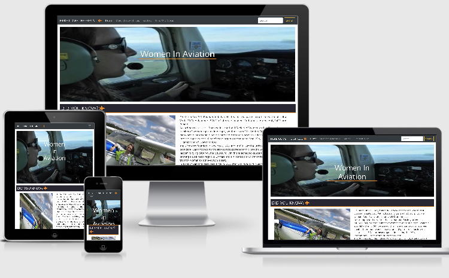

# Women In Aviation.

This is my first milestone project; Designed to exhibit my capabilities and skills in html and css, as a student 
of Code Institue (https://codeinstitute.net/).
The goal was to showcase my skills to potential employers/recruiters, on a topic that I'm deeply interested in.
My project is about inspiring more women to get into the world of aviation and become pilots.

## UX.

The purpose of the site is to provide a simple, easy to use format presenting information about the pioneers 
of women in aviation.
My website is designed for people curious about getting into aviation, specifically women, and im hopeful my website 
will give them the motivation towards getting into the cockpit.
Wireframes-
https://app.lucidchart.com/invitations/accept/32030264-f089-49a7-b77c-93d029fd57ee index.html
https://app.lucidchart.com/invitations/accept/94559158-055f-49d5-be23-1af485e18abd meet.html
https://app.lucidchart.com/invitations/accept/ff4a9209-923c-44b4-a7d5-c6616efcf7f2 gallery.html
After speaking to my mentor it was advised that I remove the carousel and have a grid system for my images to make them
more user friendly.

#### User stories- 

   * As a recruiter, I want to quickly and easily find all relevant information on the potential client.

   * As an employer, my need to find past working experience is important to me.

   * On our Human Resources team, we look for the information that pertains to the specific needs of the company, and does this individual have those skill sets.

## Features.

### Existing Features-

* __Home__ - A picture and brief introduction to what my website is about.

* __Meet the aviatrices__ -

* __Gallery__ -

* __Find out more__ -

## Technologies used.

1. **HTML, or Hyper Text Markup Language:**  Used to construct all the pages of this web site.  For further info on this language;   
 https://developer.mozilla.org/en-US/docs/Web/HTML

2. **CSS, or Cascading Style Sheets:**  Is used to style various elements on a web page via coloring, fonts, spacing, etc.  For further info, see this link;
 https://www.w3.org/Style/CSS/Overview.en.html

3. **Bootstrap:**  A CSS framework that assists the programmer in creating responsive, mobile first front-end web sites. https://getbootstrap.com/

4. **Visual Studio Code:**  Is a programming code editor created by Microsoft that I used extensively. It allows programmers to create, save and edit their code on their own pc's.
 https://code.visualstudio.com/

5. **SourceTree:**  A software application that runs on your computer that simplifies saving your programming code from your PC up to an oline respository like Github.  You do not have to use a command line interface when using this application.  For further info; 
  https://www.sourcetreeapp.com/

6. **Gitpod:**  An online IDE also used for creating & saving code that runs in a browser, it does not have to be installed on your PC.
 https://www.gitpod.io/

7. **Git:**  A version control system for tracking changes in source code during software development. https://git-scm.com/

8. **GitHub:** A company that provides hosting for software development version control using Git. It is a subsidiary of Microsoft. https://github.

9. **Chrome DevTools:**   A set of web developer tools built directly into the Google Chrome browser. I used these tools constantly thoughout the development cycle.
 https://developers.google.com/web/tools/chrome-devtools

10. **W3C Markup Validation Service**  Used to run all html and css code thru a validation process looking for errors; https://validator.w3.org/
 https://jigsaw.w3.org/css-validator/validator

## Testing.
  
1.  http://ami.responsivedesign.is/  has been used to see how the site performs on different Apple devices and their viewports, all pages, links, icons performed as expected on all devices. I also used it to create the AppleDevicesView.png at the top of this Readme.

2.  **Laptop**
     
       * Google Chrome browser; all pages, links on those pages, and footer icon links perform well on all viewport sizes. Developer tools were also used on browser for the various viewport sizes.

3.  **Modal**

      * Modal opens on every page. Submit, close and x button all close modal.

5.  **Open Issues:** Required field for full name and email in modal doesn't work. Needs Java Script but thats out of my 
     skillset at the moment. Also my images are a little streched in some viewports, but as the images were taken inflight I can't 
     change that.

## Deployment.

1. Created a Github account at https://github.com
  My account url;    https://github.com/Gwen-Bradbury

2. I uploaded all files to my Github repository located at this url; https://github.com/Gwen-Bradbury/MS1  which is for this individual project.

3. To publish the project to see it on the web, I then went into the Settings on my respository, scrolled down to the heading, GitHub Pages. Under the Source setting, I used the drop-down menu to select master branch as a publishing source and saved it.  Refreshed the github page, and you are then given a url where your page is published;
   Your site is published at https://gwen-bradbury.github.io/MS1/

4.  To run this code on your local machine, you would go to my respository at 
https://github.com/BobHerold/RobertHeroldportfolio   and on the home page on the right hand side just above all the files, you will see a green button that says,
"Clone or download", this button will give you options to clone with HTTPS, open in desktop or download as a zip file.
To continue with cloning, you would;
  * Open Git Bash
  * Change the current working directory to the location where you want the cloned directory to be made.
  * Type git clone, and then paste this URL; https://github.com/BobHerold/RobertHeroldportfolio.git      Press Enter. Your local clone will be created.

  For more information about the above process; https://help.github.com/en/github/creating-cloning-and-archiving-repositories/cloning-a-repository

## Credits.

### Content

1. bootstrap modal taken directly from bootstraps components. https://getbootstrap.com/ 

2. W3C Schools; Used for the cards in Meet the aviatrices section (index.html) and meet-the-aviatrices.html, and for the
bored around the gallery section (index.html), and gallery.html. https://w3schools.com

3. Google Fonts for font styles; https://fonts.google.com/

4. All statistical information taken from- International society of women pilots. https://www.iswap.org/
                                           WASP's https://www.npr.org/
                                           99's https://www.ninety-nines.org/

### Media

1. Am I Responsive web site for checking responsiveness on all Apple devices screen sizes;
   http://ami.responsivedesign.is/

2. Font Awesome for aeroplane icon and social media icons; https://fontawesome.com/

3. Images and quotes from other pilots used with thier written permission. 

4. Code Institues tutorial videos (https://codeinstitute.net/)

### Acknowledgements

1. My fantastic mentor Adegbenga helped with -navbar (added 'search')
                                          -headline image
                                          -did you know images and text (lining them up)
                                          -border around images
                                          And gave many other pieces of advice and motivation to get me through.

2. Code Institute's Slack Channels and the many alunni,mentors, tutors and users who contribute to them; the many pinned announcements, pdf files, etc. were of great help, as was the advice and motivation
given by the many members. https://app.slack.com/client/T0L30B202/C0L316Z96

3. Code Institute Tutors.

​