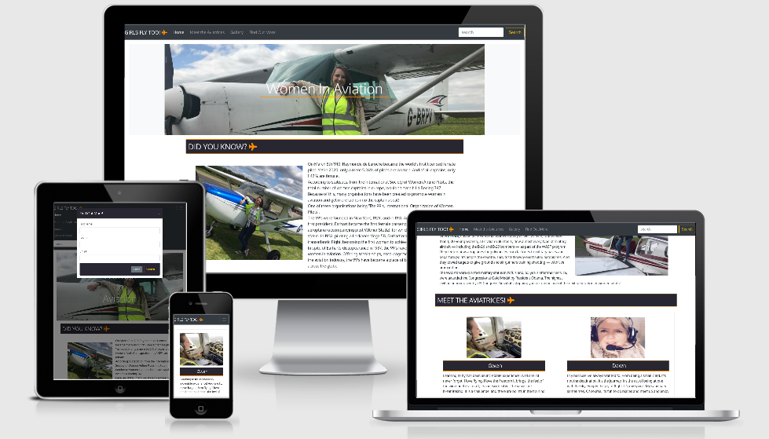

# Women In Aviation

- [Women In Aviation](#women-in-aviation)
  * [Introduction](#introduction)
  * [UX](#ux)
    + [Goals-](#goals-)
    + [Wireframes-](#wireframes-)
    + [Design](#design)
      - [Design Process-](#design-process-)
      - [Colour Palette-](#colour-palette-)
      - [Font-](#font-)
  * [User stories](#user-stories)
    + [As a Site User-](#as-a-site-user-)
    + [As a Designer-](#as-a-designer-)
    + [As an Employer-](#as-an-employer-)
  * [Features](#features)
    + [Existing Features-](#existing-features-)
      - [Features on the Home Page-](#features-on-the-home-page-)
      - [Features on the Meet the Aviatrices page-](#features-on-the-meet-the-aviatrices-page-)
      - [Features on the gallery page-](#features-on-the-gallery-page-)
    + [Features in the modal-](#features-in-the-modal-)
    + [Features left to Implement-](#features-left-to-implement-)
    + [Bugs and Fixes Implemented after Testing-](#bugs-and-fixes-implemented-after-testing-)
  * [Technologies used](#technologies-used)
    + [Languages-](#languages-)
    + [Libraries-](#libraries-)
    + [Tools-](#tools-)
  * [Testing](#testing)
    + [Validation of Code Testing-](#validation-of-code-testing-)
  * [Deployment](#deployment)
      - [Used Commands during Deployment-](#used-commands-during-deployment-)
    + [Hosting on GitHub Pages-](#hosting-on-github-pages-)
    + [Forking the GitHub Repository -](#forking-the-github-repository--)
    + [Running this Project Locally-](#running-this-project-locally-)
  * [Credits](#credits)
    + [Content-](#content-)
    + [Media-](#media-)
    + [Acknowledgements-](#acknowledgements-)
  * [Disclaimer](#disclaimer)
      - [This website was made for educational purposes only](#this-website-was-made-for-educational-purposes-only)

<small><i><a href='http://ecotrust-canada.github.io/markdown-toc/'>Table of contents generated with markdown-toc</a></i></small>

## Introduction

This is my first milestone project; Designed to exhibit my capabilities and skills in html and css, as a student
of Code Institute. (https://codeinstitute.net/)
The goal was to showcase my skills to potential employers/recruiters, on a topic that I'm deeply interested in.
My project is about inspiring more women to get into the world of aviation and become pilots. This website allows users to to discover female pilots and learn a bit about why they fly.
It presents a landing page with information on both aviation pioneers and female pilot organisations working to support and encourage women in the flight deck.
The meet the aviatrices page is a list of current pilots complete with picture and summary of why they enjoy flying.
The gallery page boasts a collection of inflight images to give the user and idea of what its like to fly an aircraft.
The Find out more modal allows users to email the site owner specific questions and inquiries.
The website is colourful and engaging, drawing the user in with bright, bold images and standout text, which I hope entices them
to get behind the controls of an aircraft.

A link to my website can be found [here](https://gwen-bradbury.github.io/MS1/)

## UX

### Goals-

The purpose of the site is to provide a simple, easy to use format presenting information about the pioneers
of women in aviation.
My website is designed for people curious about getting into aviation, specifically women, and im hopeful my website
will give them the motivation towards getting into the cockpit.
The website is fully functional and interactive giving the user a positive experience as they move throught the pages.
I focused on a design that would be engaging and easy to navigate so users will continue to repeatedly visit and make use of the
features inplimented within the website.

### Wireframes and Mock Up's-

I have produced a mock up of all of my app's pages. You can view them [here](./WIREFRAMES.md)

### Design

#### Design Process-

1. _Strategy Plane_ - From the onset I knew that my primary aim was to inform people about the lack of women in the aerospace industry and inspire more women into the captains seat.
   My main focus thoughout this project has been to excute this aim.
   I started the UX process by making a list of user stories, which allowed me to visualise what would be necessary to satisy them.

2. _Scope Plane_ - Having decided the main aim for the project, I began outlining the key features that I wanted my website to have.
   To do so I focused on the features I wanted to implement within my website as I knew this would be crucial to the aim of making the website visually appealing, user friendly and ultimately giving the user a positive experience.
   This led me to decide that I wanted to focus on four key features: an information page on the pioneers of female aviators and groups that support women in aviation, a page of current female pilots, a gallery of inflight images and a contact us form to allow the user to ask any specific questions.

3. _Structure Plane_ - Once I had narrowed down the features I wanted to include, I formulated the structure of my design into 3 seperate pages and a modal: "Home", "Meet the Aviatrices", "Gallery" and the "Contact Us" modal.
   The "Home" page tells users about some of the pioneers in aviation and some of the worlds organisations there to support women already in the aviation sector and those wanting to join. The "Home" page also has sections that contain information and links, which take the user to the other two pages.
   After this came the "Meet the Aviatrices" page which hosts pictures of some current female pilots and a quote on why they enjoy flying. The "Gallery" page is where users can see images taken from the flight deck on various flights. If the user has any specific questions or experiences any problems whlst using the site they can send the website owner thier name and email using the "Contact Us" modal.
   The modal opens over every page and can be accessed from the navbar which is visable on every page, along with the footer, to make navigating through the site simple and consistant.

4. _Skeleton Plane_ - As mentioned in the Structure Plane, I decided to use a navbar as the source of navigation through the website. This allows the user to move thoughout the site at a pace that suits them, in the easiest way possible. Returning users can find the page they're looking for, using the navbar, without having to scroll through lots of information they've already seen on previous visits to get to the page they want.

5. _Surface Plane_ -

- For my design to work, I knew that it would be important to create a theme that would keep the user interested. My first design decision was therefore to make the website as bright and colourful with images of different flights and pilots to gain and keep thier attention.
- With this in mind, I began experimenting with my wireframes. I found it useful to generate a color scheme using coolors, which provided me with contrasting colours for my website and found images that complemented that colour scheme.
- With the wireframes complete I began experimenting with the features I wanted to implement and used seperate folders for my images and a seperate page for my CSS.

> Note: Throughout the design process, I kept referring back to my original 'Main Aims' and 'User Stories' to make sure that my project was developing as intended.

#### Colour Palette-

I used coolors to generate my colour scheme-

https://coolors.co/292122-fe6d04-fdffff

I chose #04010eda and #ff8c00 for my header, footer and headings backgrounds as the two colours contrast and make those aspects stand out. The dark colour makes the website look proffessional, yet, like with flying, it needed that element of fun which I acheived with the orange border and font awesome icons.
I used #ff8c00 as the background of my 'more' buttons to give more emphasis to the user controls.
The heading text colour I left #FFF white so it could be read easily by the user.
The "Did You Know" text, pilot quotes and gallery text I left black against the white background to give it a clean, easy to read formatt.

#### Font-

The Fonts I used for this project are Oxygen and Open Sans with the font weights:

- 300 - For my modal body used with font Open Sans.
- 400 - For my html body used with font Oxygen.

The fonts were chosen as they complemented the overall design and feel I wanted for the website.
The underline text decoration was used on some of the smaller headings to make them stand out.

## User stories

### As a Site User-

- As a potential female pilot, I want to quickly and easily find all relevant information on women in aviation. A brief history on women in avitation can be found in the index.html home page. 

- As a potential female pilot, I want a support group to support me mentally through my training. The Meet The Aviatrices page has a list of current pilots, including a picture and small discription on why they love flying. 
  
- As a user, I want ot be able to communitcate with the site owner. Users can add thier name and email into the Find Out More modal and someone will email them back to answer any specific questions they might have.

- As a user, I want to know how the website works and have easy to follow instructions.

- As a user, I want to know when I take the wrong action or when something doesn't work.

- As a user, I want the the website to be easy to use and navigate.

### As a Designer-

- As a web designer and developer, I want my website to be user friendly with easy to navigate pages, and messages that tell the user when things aren't working as they should.
  
- As a web desiner and developer, My website should leave the user feeling positive and with the knowledge they were looking for within the site. Information on the site should be presented in a simple, clean formatt, with no unexpected surprises for the user.

### As an Employer-

- As an employer/recruiter, I need to see and review the skills and work capabilities, and analyze if you have the skills we require. In this website I've used many user-friendly features to showcase my skills as a developer.
  From the layout and colour scheme to the scroll bar on the Meet The Aviatrices quotes section, every implemented piece of code has been built to make the site as appealing and easy to use for customers as possible.
  Possible employers will be able to see from the website and the features implemented that my standard of work is very high, and my capabilities reflect my current skillset, which will improve as I gain more knowledge moving through
  the Code Institute Full Stack Developer course.

- On our Human Resources team, we look for the information that pertains to the specific needs of the company, and does this individual have those skill sets. My skill sets are evidenced in the website produced. I've used a wide range of HTML and CSS to
  develop this site, as well as technologies such as bootstrap for responsiveness.

## Features

-   Responsive on all device sizes.

### Existing Features-

#### Features on the Home Page-

- _Navbar_ - Holds the name of the page and links that will take the user to the other pages of the site when clicked. It has a dropdown toggle for use on smaller screens and is fixed so will always be seen by the user. 
The nav links have an a:hover CSS element that allows the user to see that the cursor is over a nav link and that it can be clicked.

- _Headliine Image_ - The main image gives the user a hint as to what the sites about. It features a woman at the controls of an aeroplane. It also holds the heading 'Women In Aviation'.

- _Did you know_ - A brief history on women in aviation and information on the various organisations around the world, who's primary objective is to support women in aviation and to ecourage more women to take up flying. It also contains two images to catch the users eye and keep them engaged.

- _Meet the Aviatrices_- A section that holds a selection of female pilots taken from the 'Meet the Aviatrices' page. This section also has a 'More Pilots' button that will take the user from that section to the 'Meet the Aviatrices' page - an alternative to using the navbar.

- _Gallery_ - A section that holds a selection of inflight images taken from the 'Gallery' page. This section also has a 'More Images' button that will take the user from that section to the 'Gallery' page - an alternative to using the navbar.

- _footer_ - Includes social media links in the form of font awesome icons.

The Navbar and Footer are repeated on the other pages of the website to give the website pages consistancy and flow.

#### Features on the Meet the Aviatrices page-

- _Images_ - A selection of current female pilots. Their pictures are taken next to/or at the controls of the type of aircraft they fly to inspire a future generation of pilots.

- _Quote_ - Underneath the photos of the pilots is a heading with thier name in and a quote on why they love flying and what spurred them into the captains seat. The quotes have a scroll bar to make the page look more tidy.

#### Features on the gallery page-

- _Images_ - In flight images taken on various flights to hopefully give the viewer a closer look into the life of a pilot. 

- _Text_ - A heading with the photo title in and a short sentence or two explaining a bit about the image sits underneath it. 

### Features in the modal-

- _Modal Form_ - This allows potential pilots to request more information by leaving their name and email address, allowing for more specific questions to be answered that may not relate to every individual. Users can also use the modal to inform the site owner of any problems encountered whilst visiting the site.
Try to submit the form without a correct syntax e-mail address and you will get an error message requesting a proper e-mail address be entered. Trying to submit the form with any empty fields will also give you a "Please fill out this field" message.

### Features left to Implement- 

- _Search bar_ - I want the users to be able to use the search bar to search the site.

- _More Pilots_ - In the future I'd like to add more feamle pilots to the 'Meet the Aviatrices' page.

- _Modal_ - I want the modal to eventually auto send an email back to the user informing them that thier email has been recieved.

- _Language Button_ - A button that can be clicked that translates the site into different languages so more people can use it.

### Bugs and Fixes Implemented after Testing-

- _Images_ - The Images within the gallery section index.html and gallery.html made two per row on larger screen sizes instead of 3 per row.

- _Max-height_ - Added a CSS max-height and width to my images.

- _Changed Logo_ - It was too long and caused response issues.

- _Changed Headline Image_ - The old one cause response issues.

## Technologies used

### Languages-

1. **HTML, or Hyper Text Markup Language:** Used to construct all the pages of this web site. For further info on this language;  
   https://developer.mozilla.org/en-US/docs/Web/HTML

2. **CSS, or Cascading Style Sheets:** Used to style various elements on the web page via coloring, fonts, spacing, etc. For further info, see this link;
   https://www.w3.org/Style/CSS/Overview.en.html

### Libraries-

1. **Bootstrap:** A CSS framework that assists the programmer in creating responsive, mobile first front-end web sites. https://getbootstrap.com/

### Tools-

1. **Gitpod:** An online IDE also used for creating & saving code that runs in a browser, it does not have to be installed on your PC.
   https://www.gitpod.io/

2. **Git:** A version control system for tracking changes in source code during software development. https://git-scm.com/

3. **GitHub:** A company that provides hosting for software development version control using Git. It is a subsidiary of Microsoft. https://github.

4. **Chrome DevTools:** A set of web developer tools built directly into the Google Chrome browser. I used these tools constantly thoughout the development cycle.
   https://developers.google.com/web/tools/chrome-devtools

5. **W3C Markup Validation Service:** Used to run all html and css code thru a validation process looking for errors; https://validator.w3.org/
   https://jigsaw.w3.org/css-validator/validator

## Testing

I carried our substantial testing on all of my apps pages and links. You can see the results of the tests [here](./TESTING.md)

### Validation of Code Testing- 

   - All of my HTML and CSS was run through the validators without returning any errors.  

## Deployment

This website was developed in Gitpod and pushed to the remote repository, GitHub. The live page is hosted on GitHub Pages.

#### Used Commands during Deployment-

1. git add . - To add files to staging area.

2. git commit -m "message here" - To commit the files.

3. git push - To push the committed files to the origin master branch on github.

4. git status - To see the current state of the files.

### Hosting on GitHub Pages-

1. Created a Github account at https://github.com
   My account url; https://github.com/Gwen-Bradbury

2. I uploaded all files to my Github repository located at this url; https://github.com/Gwen-Bradbury/MS1 which is for this individual project.

3. To publish the project to see it on the web, I then went into the Settings on my respository, scrolled down to the heading, GitHub Pages. Under the Source setting, I used the drop-down menu to select master branch as a publishing source and saved it. Refreshed the github page, and you are then given a url where your page is published;
   Your site is published at https://gwen-bradbury.github.io/MS1/

### Forking the GitHub Repository -

By forking the GitHub Repository we make a copy of the original repository on our GitHub account to view and/or make changes without affecting the original 
repository by using the following steps...

1. Log in to GitHub and locate the [GitHub Repository](https://github.com/)

2. At the top of the Repository (not top of page) just above the "Settings" Button on the menu, locate the "Fork" Button.

3. You should now have a copy of the original repository in your GitHub account.

### Running this Project Locally-  

1. To run this code on your local machine, you would go to my respository at
   https://github.com/Gwen-Bradbury/MS1 and on the home page on the right hand side just above all the files, you will see a green button that says,
   "Clone or download", this button will give you options to clone with HTTPS, open in desktop or download as a zip file.
   To continue with cloning, you would;

- Open Git Bash
- Change the current working directory to the location where you want the cloned directory to be made.
- Type git clone, and then paste this URL; https://github.com/Gwen-Bradbury/MS1.git Press Enter. Your local clone will be created.

For more information about the above process; https://help.github.com/en/github/creating-cloning-and-archiving-repositories/cloning-a-repository

## Credits

### Content-

1. Bootstrap modal taken directly from bootstraps components https://getbootstrap.com/

2. W3C Schools; Used for the cards in Meet the aviatrices section (index.html) and meet-the-aviatrices.html, and for the
   border around the gallery section (index.html), and gallery.html. https://w3schools.com

3. Google Fonts for font styles https://fonts.google.com/

4. All statistical information taken from-

- International society of women pilots. https://www.iswap.org/
- WASP's. https://www.npr.org/
- 99's. https://www.ninety-nines.org/

5. Colour scheme https://coolors.co/292122-fe6d04-fdffff

6. Wireframes https://app.lucidchart.com/

7. Form in modal taken from bootstraps components https://getbootstrap.com/

### Media-

1. Am I Responsive web site for checking responsiveness on all Apple devices screen sizes;
   http://ami.responsivedesign.is/

2. Font Awesome for aeroplane icon and social media icons https://fontawesome.com/

3. Images and quotes from other pilots used with thier written permission

4. Code Institues tutorial videos (https://codeinstitute.net/)

5. Contents table in README.md from http://ecotrust-canada.github.io/markdown-toc/

### Acknowledgements-

1. My mentor Adegbenga for his help and many other pieces of advice alongside motivation to get me through.

2. Code Institute's Slack Channels and the many alunni, mentors, tutors and users who contribute to them; the many pinned announcements, pdf files, etc. were of great help, as was the advice and motivation
   given by the many members. https://app.slack.com/client/T0L30B202/C0L316Z96

3. The amazing Code Institute Tutors.

4. My wonderful pilot friends for their Images and quotes.

## Disclaimer

#### This website was made for educational purposes only
