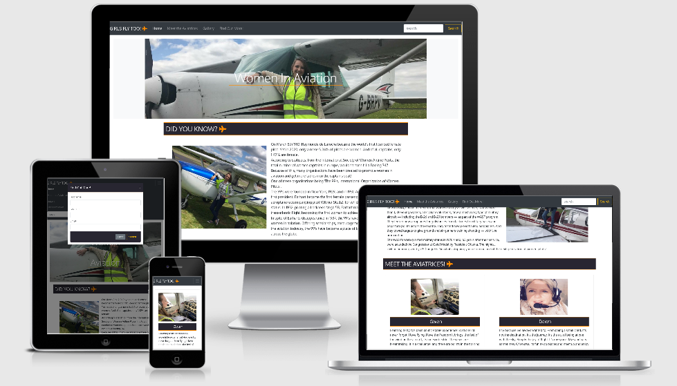

# Girls Fly Too!

- [Testing](#testing)

** Back to [README.md](./README.md) **

## Testing

I carried our substantial testing on all of my apps pages and links.

1.  http://ami.responsivedesign.is/ has been used to see how the site performs on different Apple devices and their viewports, all pages, links, icons performed as expected on all devices. I also used it to create the AppleDevicesView.png at the top of this Readme.

2.  **Laptop**
    - Google Chrome browser; all pages, links on those pages and footer icon links perform well on all viewport sizes. Developer tools were also used on browser for the various viewport sizes.
The webpages are responsive aa are the images whilst maintaning user friendly design aspects.
* All buttons on the 'Home' page were pressed with correct responses given. 
* The 'More Pilots' button takes the user to the 'Meet The Aviatrices' page.
* The 'More Images' button takes the user to the 'Gallery' page.  
* Nav links were clicked and tested for responses. All Nav links take users to the appropriate pages.
* The 'Home' navlink brings users to the 'Home' page.
* The 'Meet the Aviatrices' navlink takes the user to the the 'Meet The Aviatrices' page.
* The 'Gallery' navlink takes the user to the 'Gallery' page.
* The modal was opened on every page to ensure correct UX design.
* The 'Submit' modal button closes the modal.
* The 'Close' modal button closes the modal.
* The 'x' closes the modal.  

    

3.  **Mobile**
    - Safari browser; all pages, links on those pages and footer icon links perform well. 
The webpages are responsive and the images and contact form respond as expected whilst maintaning user friendly design aspects. All buttons, markers and links were clicked and tested for responses, all features were used and tested with appropriate responses given.
* All buttons on the 'Home' page were pressed with correct responses given. 
* The 'More Pilots' button takes the user to the 'Meet The Aviatrices' page.
* The 'More Images' button takes the user to the 'Gallery' page.  
* Nav links were clicked and tested for responses. All Nav links take users to the appropriate pages.
* The 'Home' navlink brings users to the 'Home' page.
* The 'Meet the Aviatrices' navlink takes the user to the the 'Meet The Aviatrices' page.
* The 'Gallery' navlink takes the user to the 'Gallery' page.
* The modal was opened on every page to ensure correct UX design.
* The 'Submit' modal button closes the modal.
* The 'Close' modal button closes the modal.
* The 'x' closes the modal.  

4.  **Ipad Pro**
    - Safari browser; all pages, links on those pages and footer icon links perform as they should. 
The webpages are responsive and the images and contact form respond as expected whilst maintaning user friendly design aspects. All buttons, markers and links were clicked and tested for responses, all features were used and tested with appropriate responses given.
* All buttons on the 'Home' page were pressed with correct responses given. 
* The 'More Pilots' button takes the user to the 'Meet The Aviatrices' page.
* The 'More Images' button takes the user to the 'Gallery' page.  
* Nav links were clicked and tested for responses. All Nav links take users to the appropriate pages.
* The 'Home' navlink brings users to the 'Home' page.
* The 'Meet the Aviatrices' navlink takes the user to the the 'Meet The Aviatrices' page.
* The 'Gallery' navlink takes the user to the 'Gallery' page.
* The modal was opened on every page to ensure correct UX design.
* The 'Submit' modal button closes the modal.
* The 'Close' modal button closes the modal.
* The 'x' closes the modal.  

5. **Desktop**
    - Google Chrome browser; features and icon links perform well on all viewport sizes. 
Developer tools were also used on browser for the various viewport sizes. 
The webpages are responsive and the images and contact form repsond as expected whilst maintaning user friendly design aspects. 
All buttons, markers and links were clicked and tested for responses, all features were used and tested with appropriate responses given.
        * All buttons on the 'Home' page were pressed with correct responses given. 
        * The 'More Pilots' button takes the user to the 'Meet The Aviatrices' page.
        * The 'More Images' button takes the user to the 'Gallery' page.  
        * Nav links were clicked and tested for responses. All Nav links take users to the appropriate pages.
        * The 'Home' navlink brings users to the 'Home' page.
        * The 'Meet the Aviatrices' navlink takes the user to the the 'Meet The Aviatrices' page.
        * The 'Gallery' navlink takes the user to the 'Gallery' page.
        * The modal was opened on every page to ensure correct UX design.
        * The 'Submit' modal button closes the modal.
        * The 'Close' modal button closes the modal.
        * The 'x' closes the modal. 

    - Internet Edge; features and icon links perform well on all viewport sizes. 
Developer tools were also used on browser for the various viewport sizes. 
The webpages are responsive and the images and contact form respond as expected whilst maintaning user friendly design aspects. 
All buttons, markers and links were clicked and tested for responses, all features were used and tested with appropriate responses given.
        * All buttons on the 'Home' page were pressed with correct responses given. 
        * The 'More Pilots' button takes the user to the 'Meet The Aviatrices' page.
        * The 'More Images' button takes the user to the 'Gallery' page.  
        * Nav links were clicked and tested for responses. All Nav links take users to the appropriate pages.
        * The 'Home' navlink brings users to the 'Home' page.
        * The 'Meet the Aviatrices' navlink takes the user to the the 'Meet The Aviatrices' page.
        * The 'Gallery' navlink takes the user to the 'Gallery' page.
        * The modal was opened on every page to ensure correct UX design.
        * The 'Submit' modal button closes the modal.
        * The 'Close' modal button closes the modal.
        * The 'x' closes the modal.  

    - Mozilla Firefox; features and icon links perform well on all viewport sizes. 
Developer tools were also used on browser for the various viewport sizes. 
The webpages are responsive and the images and contact form respond as expected whilst maintaning user friendly design aspects. 
All buttons, markers and links were clicked and tested for responses, all features were used and tested with appropriate responses given.
        * All buttons on the 'Home' page were pressed with correct responses given. 
        * The 'More Pilots' button takes the user to the 'Meet The Aviatrices' page.
        * The 'More Images' button takes the user to the 'Gallery' page.  
        * Nav links were clicked and tested for responses. All Nav links take users to the appropriate pages.
        * The 'Home' navlink brings users to the 'Home' page.
        * The 'Meet the Aviatrices' navlink takes the user to the the 'Meet The Aviatrices' page.
        * The 'Gallery' navlink takes the user to the 'Gallery' page.
        * The modal was opened on every page to ensure correct UX design.
        * The 'Submit' modal button closes the modal.
        * The 'Close' modal button closes the modal.
        * The 'x' closes the modal.  

6. **Modal**
   - Modal opens on every page. Submit, close and x button all close modal. Modal is responsive and all buttons and fields have been filled out, pressed and tested on all veiwport sizes, and it all reponds as expected whilst maintaining user friendly design aspects.

7. **Manual Testing**
    - Various browsers and devices; the project was shared in the peer-code-review CI slack room and was tested by other CI Students, Mentors, Alumni and Tutors. 
This is in direct relation to the 'Goals' and 'User Stories' from the 'UX' Section.
The results of this were -
        1. Users can easily understand the main purpose of the site.
        2. It's colorful and engaging.
        4. Users can find what they're looking for quickly and easily, using the navbar links.
        5. The website is easy to use and has easy to follow instructions.
        6. The site has been designed to be fluid and never to entrap the user.
        8. Links in the navbar are labelled clearly.
        9. Information is layed out clearly and is easy to read.

    - The developer tested all the nav links, clicking them one at a time confirming that they take the user to the correct page.
    - The 'Home' navlink was tested resulting in the 'Home' page being loaded as programmed.
    - The 'Meet The Aviatrices' navlink was tested resulting in the 'Meet The Aviatrices' page being loaded.
    - The 'Gallery' navlink was tested resulting in the 'Gallery' page being loaded as expected.
    - The 'Find out More' modal was opened on every page to check it didn't cause any issues.
    - The form within the modal was tested for validation firstly inputing incorrect data into the first field, then the second and finally the third. Validation was clear with simple instructions on every field.
    - The 'Submit' and 'Cancel' buttons both close the modal.
    - On the 'Home' page the 'More Pilots' button was clicked which loaded the 'Meet The Aviatrices' page as expected.
    - On the 'Home' page the 'More Images' button was clicked which loaded the 'Gallery' page as expected.
    - The developer checked the navlinks from the other pages and they all loaded thier respective pages as programmed.      

The developer used dev tools to check the resposiveness of all the apps pages, using the dropdown burger menu, which opened from the left as programmed, to click every page link. The 'Top' button was pressed on every page to test for the required action on smaller screen sizes, with the correct response given. The images were viewed and buttons all pressed on various browser sizes in dev tools to check responsiveness, along with forms and the search bar. All pages and thier contents were fully responsive whilst maintaining user friendly design aspects.

8. **Open Issues:**
   
   - Modal required field can be sightly out of line on some mobile views.

** Back to [README.md](./README.md) **
