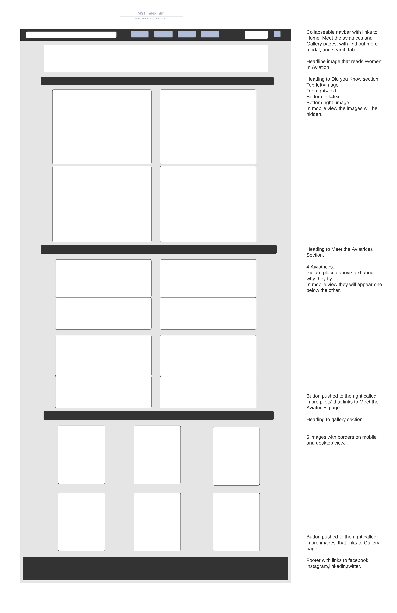
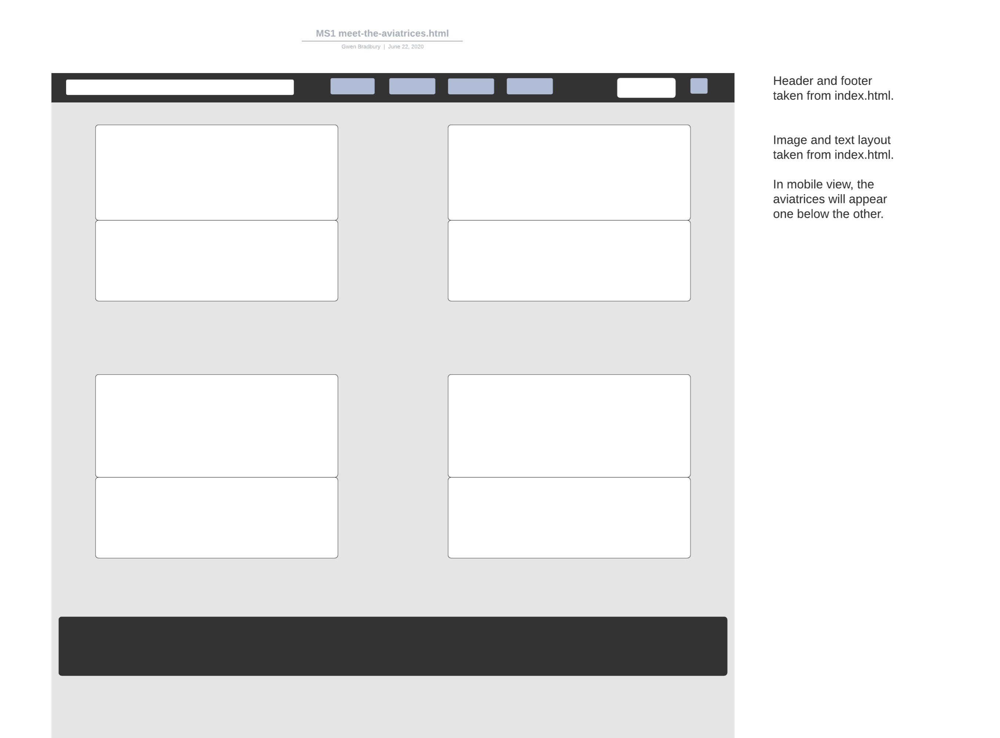
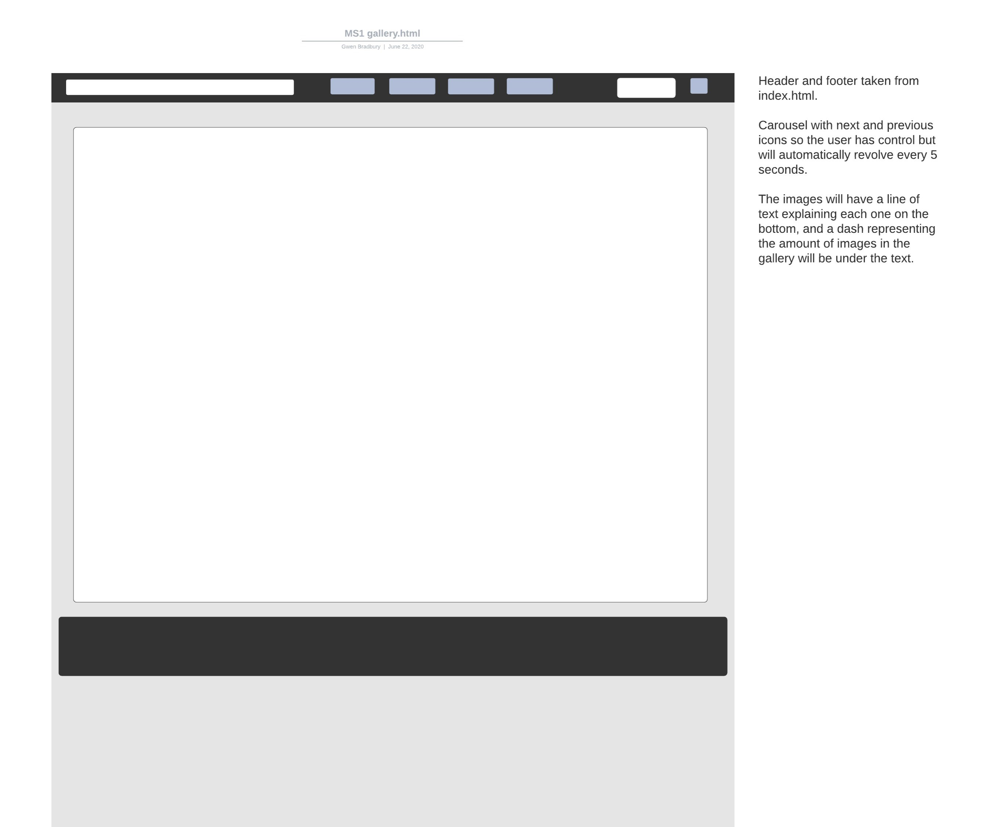

# Girls Fly Too! 

- [Wireframes-](#wireframes-)
- [Mock Up's -](#mock-up-s--)

<small><i><a href='http://ecotrust-canada.github.io/markdown-toc/'>Table of contents generated with markdown-toc</a></i></small>

### Wireframes-

After speaking to my mentor it was advised that I remove the carousel, in gallery.html, and have a grid system for my images, to make them more user friendly.

### Mock Up's -

My mentor advised 2 Images per row in the gallery and gallery section index.html. She also advised removing the search bar as it was out of my skillset to implement and
wouldn't be graded on this assignment.

** Back to [README.md](./README.md) **